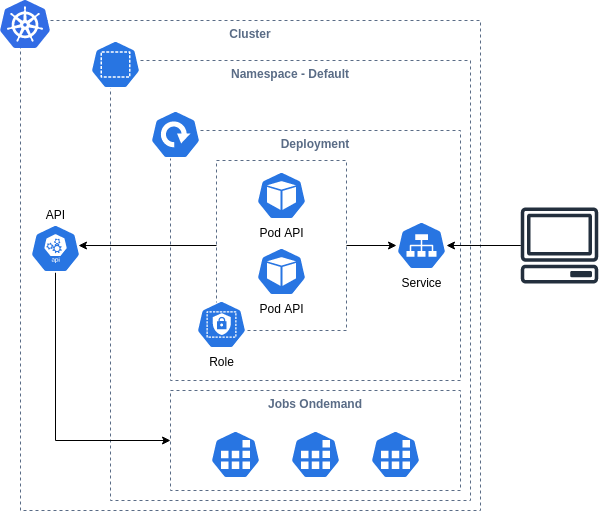

# k8s-ondemand-jobs



Simple example to create ondemand jobs for our workloads, on the cluster expose a node port service backend for a 
Flask API that can list pods on the cluster or launch jobs.

### Tools
* docker-desktop
* kubectl
* python

### Prerequisites
* Docker-desktop ready and k8s cluster run

### Deploy

```bash
make deploy
```

### API endpoint
* status - http://localhost:30000/status
* get-pods - http://localhost:30000/get-pods
* launch-job - http://localhost:30000/launch-job

### How it's works

When you call the `launch-job` endpoint the API use the k8s api to create a job template and create the job him 
on the cluster for the default namespace, to achieve this the Pods Flask API need permissions over the k8s api to that.

Need create a `ServiceAccount` for the Deployments Pods and `Role` with the permissions to list and create pods and jobs,
next of this use a `RoleBinding` to bind the `ServiceAccount` and the `Role` and attach this `ServiceAccount` to the 
pods `spec` on the deployment (`api/deployment.yaml`), this deployment file group al k8s resources for the Flask API.

When you create a `job` this job creates a pod and this pods finish but aren't delete automatically, this is a problem 
when you list all resources for a namespace these pods are showed on the terminal, for the automatic delete, the Flask API
creates a job templates with the param `ttlSecondsAfterFinished` in seconds to automatically delete these resources.

### Remove

```bash
make remove
```

### Reference links

* https://stefanopassador.medium.com/launch-kubernetes-job-on-demand-with-python-c0efc5ed4ae4
* https://medium.com/@aris.david/how-to-create-a-job-using-kubernetes-python-client-ed00ac2b791d
* https://stackoverflow.com/questions/40401795/how-can-i-trigger-a-kubernetes-scheduled-job-manually
* https://kubernetes.io/docs/concepts/workloads/controllers/job/
* https://kubernetes.io/docs/concepts/workloads/controllers/job/#clean-up-finished-jobs-automatically